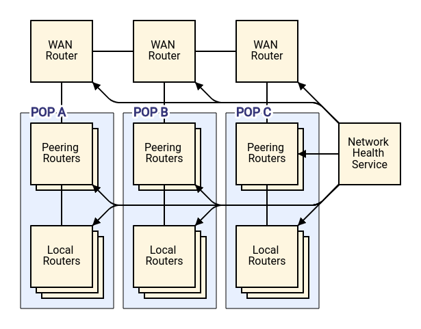
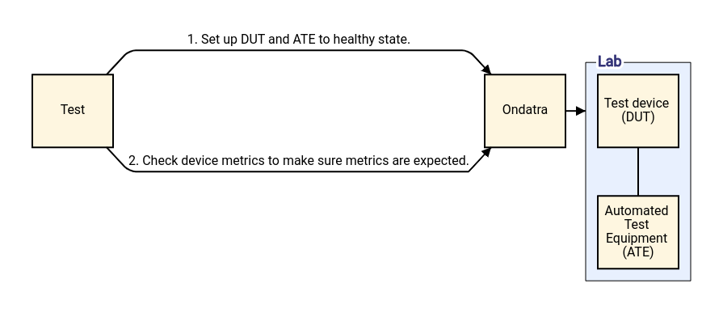
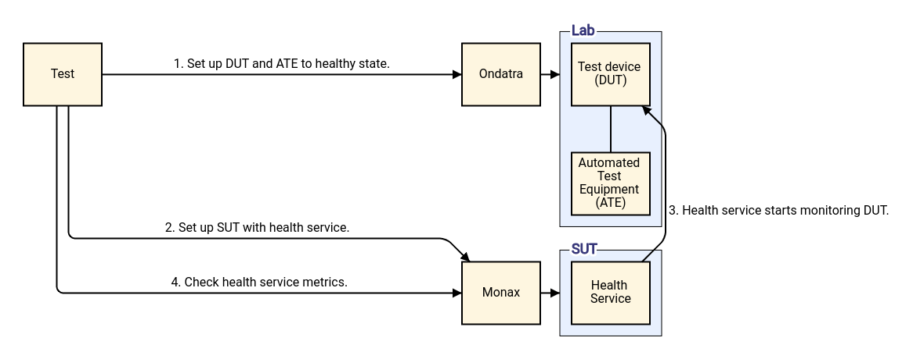

# Monax

Monax is a System Under Test (SUT) manager. It is intended to work with
[Ondatra](https://github.com/openconfig/ondatra) for writing integration tests
that verify the interaction between network management software systems and the
network devices that they control.

## Background

Ondatra lets you write functional tests for network devices (referred to as
devices under test, or DUTs). Monax lets you add a SUT to those tests so you
can do integration testing of services that interact with the DUTs. An Ondatra
functional test will make sure the device works in the way a network engineer
expects. A Monax integration test will make sure the device and services
interact in the way that network architects expect.

In Ondatra, tests are not hardcoded to specific devices. Instead, you give an
abstract definition for the kinds of devices you want to test. Ondatra then maps
that abstract testbed definition to actual devices. Because you write your test
against the abstract definition and not specific devices, the test is more
flexible.

Monax works similarly. Instead of hardcoding specific services in your test, you
give an abstract definition for your SUT and test against that abstraction.
Monax will map that abstract SUT definition to actual services. This separation
means that your integration tests can now be flexible too.

### Example

Let's say we are developing a health service to monitor router health across a
corporate network spanning a couple of Points of Presence (POPs). The
service uses gNMI to monitor the health of devices and links. We want to have
good test coverage of the interaction between the devices and the service so
that we have confidence that our network is healthy when the service says the
network is healthy.

To start, let's write functional tests to make sure that each device provides
the right health information that we care about. We set up test devices to a
known state similar to the real network and make sure that they report metrics
as expected. Then we bring the device down and make sure that its metrics are
unhealthy.

We can write this test with Ondatra by itself. It verifies the device behaves as
we expect it to. We also need to make sure that the interaction with the service
is correct. To do this, we can write an integration test with Monax and Ondatra.
We set up the test devices as before, but we additionally set up a SUT
containing an instance of our health service. We configure the health service to
monitor the test devices. We then make sure the health service is reporting that
our test network is healthy. Then we can bring the device down and make sure
that the health service responds appropriately.

## Getting Started

The [math test example](example/math/math_test.go) uses the Kubernetes runtime
to start simple gRPC servers in an existing Kubernetes cluster. The servers
provide simple math operations. The test makes calls to those servers to verify
their functionality.

For more information on how to run the math test example, please see the
[README](example/math/README.md).

## Why is it called Monax?

The [groundhog](https://en.wikipedia.org/wiki/Groundhog) (*Marmota monax*) is a
type of large ground squirrel found throughout much of North America. Also known
as woodchucks, whistle pigs, land beavers, and several other names, groundhogs
are famous for their ornery behavior and for predicting the arrival of spring on
[Groundhog Day](https://en.wikipedia.org/wiki/Groundhog_Day).

In the movie
[*Groundhog Day*](https://en.wikipedia.org/wiki/Groundhog_Day_\(film\)), the
main character becomes trapped in a time loop, reliving the same day repeatedly.
No matter how destructive his actions are, his world resets every morning,
exactly like it was the day before.

Integration testing should work the same way. No matter what your test does or
how badly it misbehaves, your system under test should be ready to go for your
next run, exactly like it was before.

As Phil might say, *Don't test angry*.
